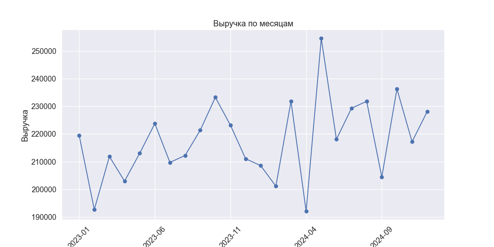

# 🛒 Анализ продаж e-commerce

**Описание проекта:**  
Анализ данных интернет-магазина: исследование ключевых метрик, построение визуализаций и аналитические выводы.  
Используем Python, Jupyter Notebook, Pandas, Matplotlib и Seaborn.

---

## 📂 Структура проекта
ecommerce-sales-analysis/
│
├── data/ # Датасеты
├── notebooks/ # Jupyter ноутбуки с анализом
├── images/ # Графики и визуализации
├── README.md # Описание проекта
└── requirements.txt # Список зависимостей

---

## 📊 Визуализации
### 1. Выручка по месяцам


### 2. ТОП-10 товаров по продажам


---

## 🔍 Что сделано:
✔ Очистка и подготовка данных  
✔ Анализ продаж по месяцам  
✔ Визуализация ключевых показателей (выручка, товары, категории)  
✔ Построение графиков (линейные, столбчатые, круговые)  

---

## 🛠 Используемые технологии:
- **Python** (3.x)
- **Jupyter Notebook**
- **Pandas**, **Matplotlib**, **Seaborn**

---

## 🚀 Как запустить проект:
1. Клонировать репозиторий:
   ```bash
   git clone https://github.com/ValikMorinko/ecommerce-sales-analysis.git


